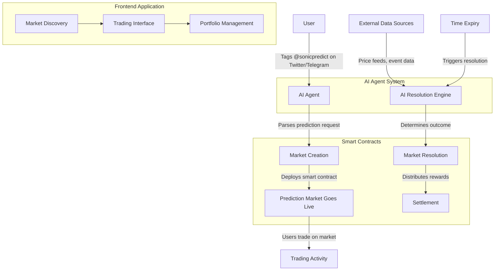

# 🚀 SonicPredict

<div align="center">
  
  <h3>AI-Powered Prediction Markets on Sonic Chain</h3>
  <p>Create, trade, and resolve prediction markets through social media with AI automation</p>
</div>

## 📊 Overview

SonicPredict is a decentralized prediction market platform built on Sonic Chain that allows users to create and participate in prediction markets through simple social media interactions. Powered by AI agents, the platform enables anyone to create markets by simply tagging the SonicPredict bot on Twitter or Telegram, with automatic market resolution using oracle data and real-time price feeds.

## ✨ Key Features

### 🌐 Social Media Integration
- Create prediction markets by tagging `@sonicpredict` on Twitter or Telegram
- Simple syntax: "Create a prediction market for 'Will Bitcoin reach $100k by end of march 2025?' with options Yes/No, duration 30 days"
- Share markets with your social network with a single click

### 🤖 AI-Powered Market Resolution
- Markets are automatically resolved by AI agents
- Integration with oracle networks for verified data sources
- Real-time price feeds from Pyth Network for financial markets
- Natural language processing for event-based outcomes

### 💰 Trading Interface
- Intuitive UI for buying and selling outcome shares
- Real-time market data and price updates
- Portfolio tracking and performance analytics
- Mobile-responsive design for trading on the go

### 🔐 Secure Infrastructure
- Smart contracts audited for security
- Non-custodial wallet integration
- Transparent market resolution mechanisms
- On-chain settlement for all transactions

## Demo Video


## 🏗️ Architecture

SonicPredict consists of three main components:

### 1. Frontend Application
The user interface built with Next.js, providing a seamless experience for market discovery, trading, and account management.

### 2. AI Agent System
An intelligent bot that monitors social media platforms, creates markets based on user requests, and resolves markets using external data sources.

### 3. Smart Contracts
The on-chain infrastructure that handles market creation, trading, and settlement on the Sonic Chain.

## 🔄 How It Works



## 🛠️ Technical Components

### Frontend (`/frontend`)
- **Next.js Framework**: Server-side rendering for optimal performance
- **React Components**: Modular UI components for market cards, trading interfaces, and user dashboards
- **Tailwind CSS**: Beautiful, responsive design system
- **Web3 Integration**: Seamless connection to blockchain wallets

### AI Agent (`/agent`)
- **Social Media Listeners**: Monitors Twitter and Telegram for market creation requests
- **Natural Language Processing**: Parses user requests into structured market parameters
- **Oracle Integration**: Connects to Pyth Network and other data sources for reliable market resolution
- **Automated Resolution**: Uses AI to determine market outcomes based on real-world data

### Smart Contracts (`/smartcontract`)
- **Market Factory**: Creates new prediction markets with customizable parameters
- **Trading Engine**: Handles order matching and share pricing
- **Settlement System**: Distributes rewards to winning positions
- **Oracle Integration**: Connects to external data sources for trustless resolution

## 🚀 Getting Started

### Prerequisites
- Node.js 16+
- Yarn or npm
- MetaMask or other Web3 wallet

### Installation

1. Clone the repository
```bash
git clone https://github.com/yourusername/sonicpredict.git
cd sonicpredict
```

2. Install dependencies for each component
```bash
# Frontend
cd frontend
yarn install

# Agent
cd ../agent
yarn install

# Smart Contracts
cd ../smartcontract
yarn install
```

3. Set up environment variables
```bash
# Copy example env files
cp frontend/.env.example frontend/.env
cp agent/.env.example agent/.env
```

4. Start the development servers
```bash
# Frontend
cd frontend
yarn dev

# Agent
cd ../agent
yarn start
```

## 📝 Usage Examples

### Creating a Market via Twitter
Tweet: "@sonicpredict Create a prediction market for 'Will ETH flip BTC by market cap in 2024?' with options Yes/No, duration 90 days"

### Trading on a Market
1. Visit the market page
2. Connect your wallet
3. Select your position (Yes/No)
4. Enter the amount you want to invest
5. Confirm the transaction

### Viewing Market Resolution
1. Navigate to the Markets tab
2. Filter by "Resolved"
3. Select a market to view the outcome and settlement details

## 🤝 Contributing

We welcome contributions to SonicPredict! Please see our [CONTRIBUTING.md](CONTRIBUTING.md) for details on how to get started.

## 📄 License

This project is licensed under the MIT License - see the [LICENSE](LICENSE) file for details.

## 🔗 Links

- [Website](https://sonicpredict.io)
- [Twitter](https://twitter.com/sonicpredict)
- [Documentation](https://docs.sonicpredict.io)
- [Discord Community](https://discord.gg/sonicpredict) 
